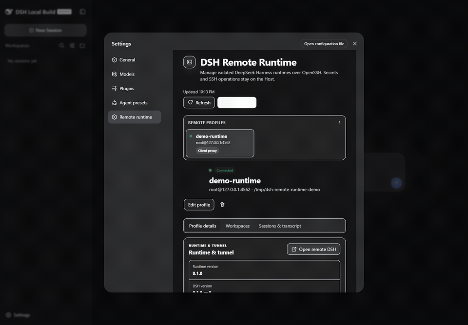
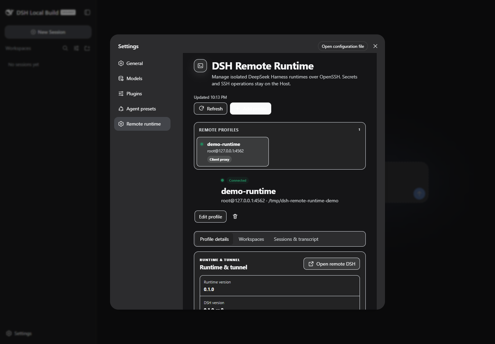
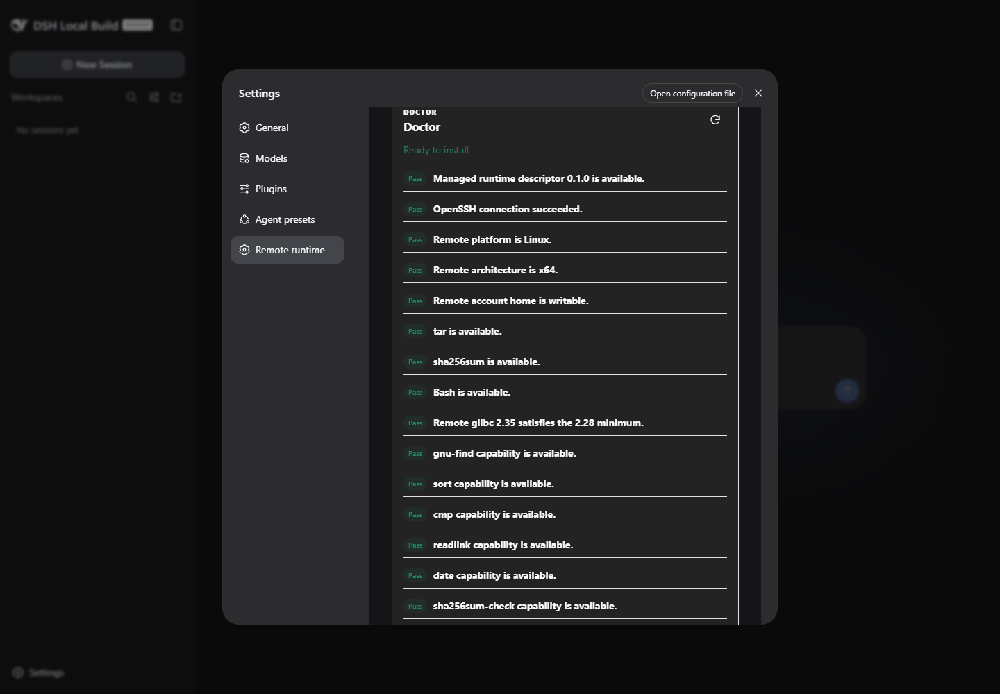
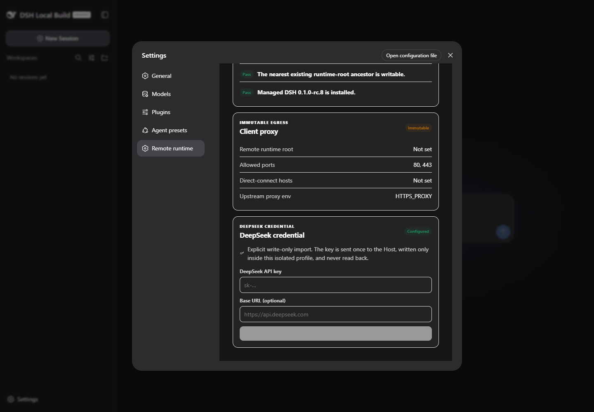
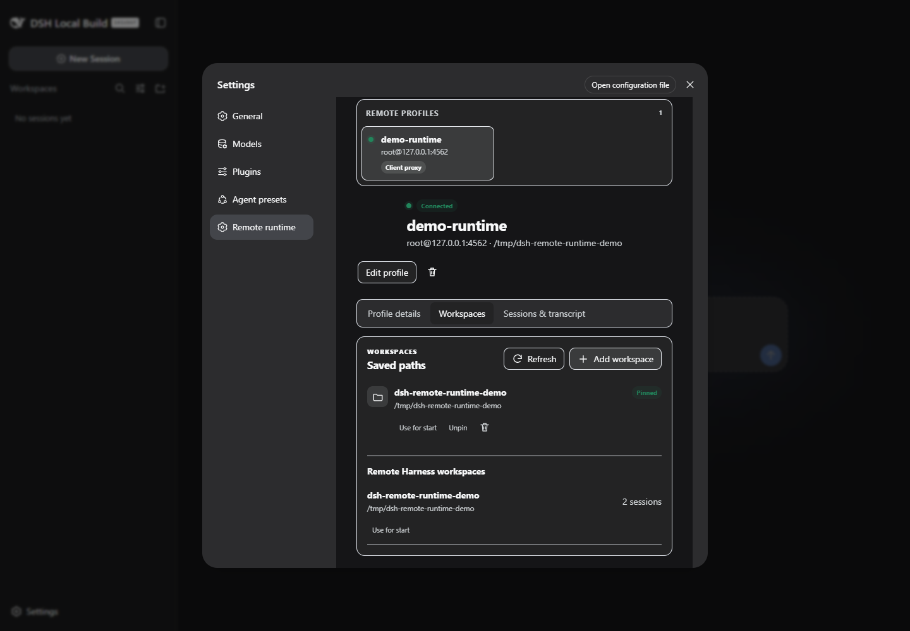
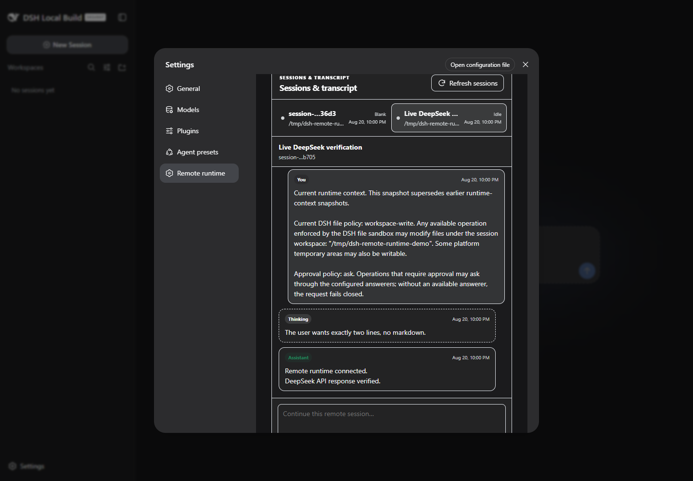
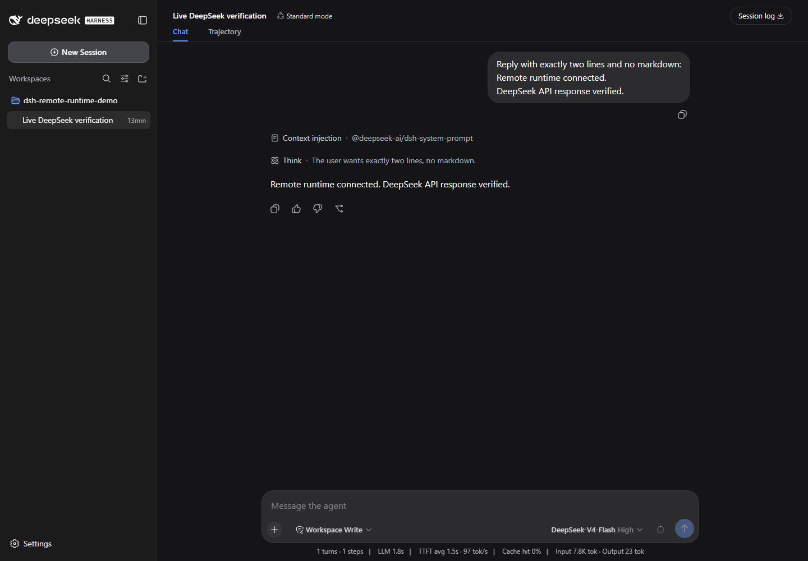
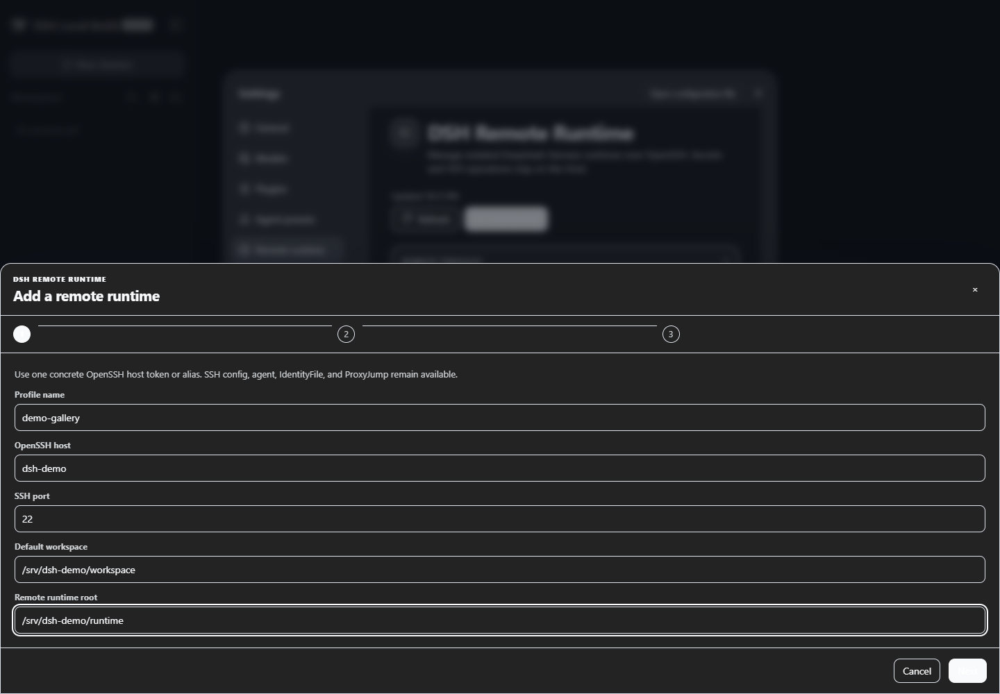
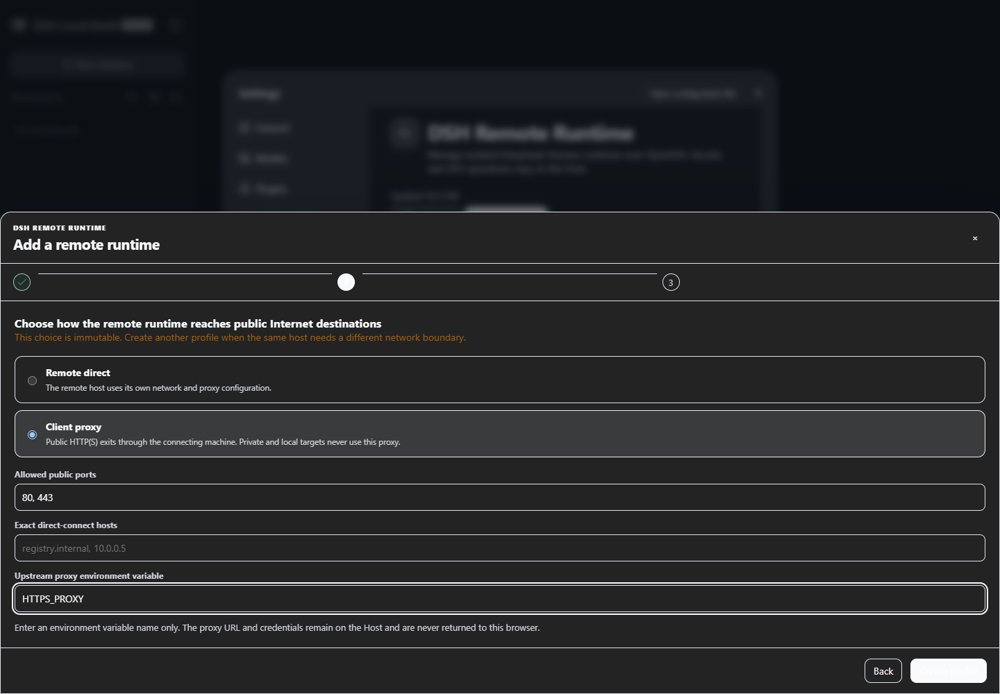

# DSH Remote Runtime

English | [简体中文](README.zh-CN.md)

**Run an isolated, official DeepSeek Harness on a Linux host and manage it through OpenSSH.** This standalone community plugin adds remote profiles, Doctor checks, verified runtime installation, tunnels, workspaces, credentials, and Session history to the DSH `0.1.0-rc.8` Web UI—without modifying Harness source.

SSH, files, processes, and secrets stay in the plugin Host. The browser receives bounded JSON summaries and never reads a stored credential.

## Demo

Captured from a real OpenSSH-managed runtime using an actual DeepSeek API credential. The key was imported before recording and never entered the browser, screenshots, GIF, logs, or repository.

<p align="center">
  
</p>

<details>
<summary><strong>More screenshots</strong></summary>

<table>
  <tr>
    <td><br><sub>Connected profile and runtime</sub></td>
    <td><br><sub>Read-only Doctor checks</sub></td>
  </tr>
  <tr>
    <td><br><sub>Write-only credential status</sub></td>
    <td><br><sub>Saved and Harness workspaces</sub></td>
  </tr>
  <tr>
    <td><br><sub>Official Session history and prompt UI</sub></td>
    <td><br><sub>Complete DSH UI through the loopback tunnel</sub></td>
  </tr>
  <tr>
    <td><br><sub>Host and isolated workspace</sub></td>
    <td><br><sub>Remote-direct or client-proxy</sub></td>
  </tr>
</table>

</details>

## Install

```powershell
npx.cmd --yes @deepseek-ai/dsh@0.1.0-rc.8 plugin --profile web add `
  @artificialnotimbecile/dsh-remote-runtime@latest
npx.cmd --yes @deepseek-ai/dsh@0.1.0-rc.8 web
```

Restart an already-running Web profile after adding, updating, or removing the plugin.

<details>
<summary><strong>Build from a checkout</strong></summary>

```powershell
corepack pnpm install --frozen-lockfile --ignore-scripts
corepack pnpm run check
corepack pnpm pack --pack-destination test-results

npx.cmd --yes @deepseek-ai/dsh@0.1.0-rc.8 plugin --profile web add `
  .\test-results\artificialnotimbecile-dsh-remote-runtime-0.1.2.tgz
```

</details>

## Use

Open **Settings → Remote runtime**:

1. Add an OpenSSH host and optional remote workspace.
2. Choose immutable `remote-direct` or `client-proxy` egress.
3. Run read-only **Doctor**, then explicitly install the verified runtime.
4. Import a DeepSeek key through the write-only form.
5. Start the runtime and open the loopback tunnel URL.
6. Browse workspaces, Session history, and send or cancel prompts.

Disconnect leaves the remote Harness running. Stop is separate, and removing a local profile never deletes remote runtime or Session data.

## Highlights

- A distinct profile UUID and remote `DSH_HOME` isolate credentials, Sessions, workspaces, and process state.
- System OpenSSH keeps SSH config, `IdentityFile`, ssh-agent, and `ProxyJump` under user control.
- The content-addressed runtime includes Node 22.19 and official DSH rc.8; the archive and every extracted file are SHA-256 verified.
- Workspace, Session, history, prompt, and cancel operations use the official DSH Host API.
- Credentials are written mode `0600` and never returned to browser state, logs, snapshots, or process arguments.
- Authenticated client-proxy egress allows public HTTP(S) only; private, loopback, link-local, CGNAT, metadata, multicast, documentation, and IPv6 local ranges fail closed.

## Compatibility and security

- Local DSH: exactly `0.1.0-rc.8`; UI: Web profile.
- Client: Windows, macOS, or Linux; Node `^22.19.0 || >=24`; system `ssh`.
- Remote: Linux x64, glibc 2.28+, Bash, `tar`, `gzip`, `sha256sum`, and a writable home.
- Every tunnel listener binds loopback; the remote DSH Web API is never exposed on `0.0.0.0`.
- SSH is the access-control boundary. Use a separate remote OS account when same-UID process isolation is required.

DeepSeek Harness is pre-release software. Later DSH versions remain unsupported until peer versions, Typert generation, assembled-profile CI, and live acceptance move together.

## Development

```powershell
corepack pnpm run typecheck
corepack pnpm run test
corepack pnpm run build
corepack pnpm run pack:check
```

Managed runtime builds require Linux or WSL; executing it requires glibc 2.28+. Generated archives, profiles, screenshots, and live logs remain under ignored `runtime/artifacts/` and `test-results/`.

## License

MIT. Independent community plugin; not affiliated with or endorsed by DeepSeek. See [THIRD_PARTY_NOTICES.md](THIRD_PARTY_NOTICES.md).
